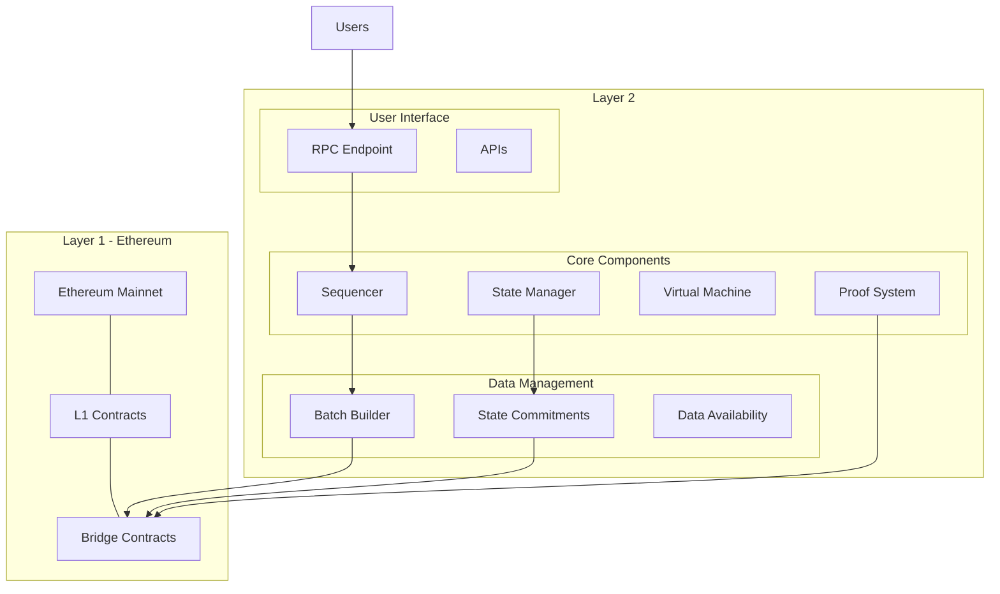
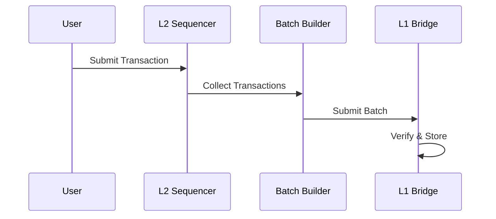
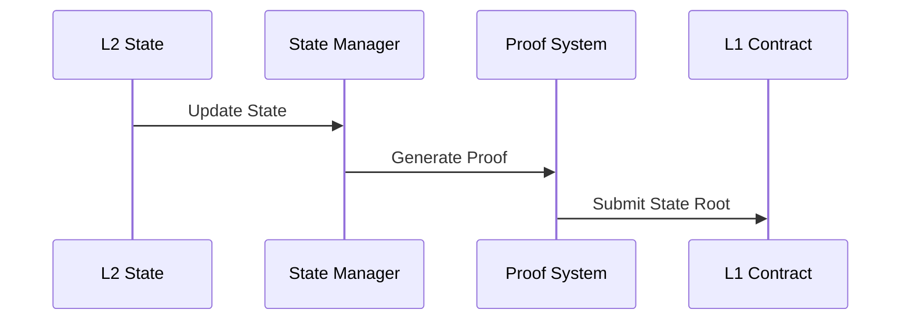

# Layer2-Architecture
Layer 2 scaling solutions build on top of Ethereum (L1) to provide increased throughput and reduced costs while inheriting L1's security guarantees.


## Architecture Diagram



## Communication Flow
### Transaction Flow

### State Updates


## Key Components
- Bridge System
  ```solidity
  interface IL1Bridge {
    // Deposit assets from L1 to L2
    function deposit(
        address l1Token,
        address l2Token,
        uint256 amount,
        uint32 gasLimit
    ) external payable;
    
    // Initiate withdrawal from L2 to L1
    function withdraw(
        address l1Token,
        address l2Token,
        uint256 amount
    ) external;
    
    // Finalize L2 to L1 withdrawal
    function finalizeWithdrawal(
        uint256 withdrawalId,
        address recipient,
        uint256 amount
    ) external;
  }
  ```
- State Management
  ```solidity
  interface IStateManager {
    // Submit state root
    function submitStateRoot(
        bytes32 stateRoot,
        bytes32 batchRoot,
        bytes proof
    ) external;
    
    // Verify state transition
    function verifyStateTransition(
        bytes32 fromState,
        bytes32 toState,
        bytes proof
    ) external returns (bool);
  }
  ```
## Security Mechanisms
- Fraud Proof System
  - Challenge Period: 7 days
  - Interactive Fraud Proof
  - Automatic Resolution
