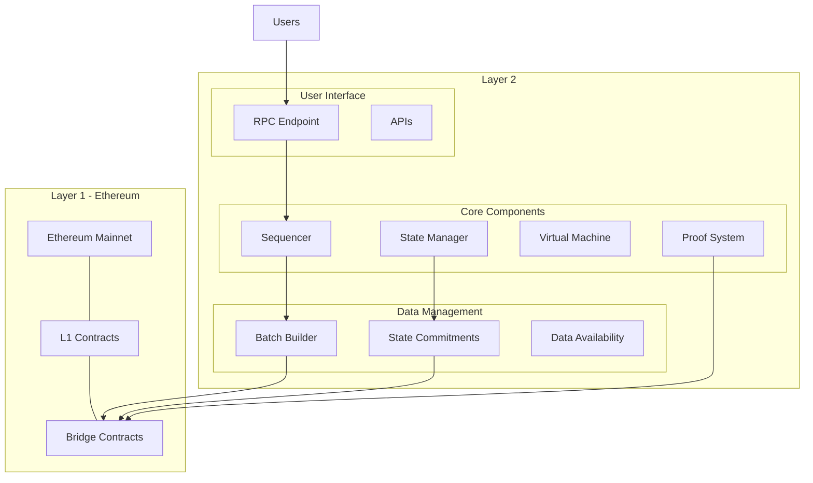

# Layer2-Architecture
Layer 2 scaling solutions build on top of Ethereum (L1) to provide increased throughput and reduced costs while inheriting L1's security guarantees.

```mermaid
graph TB
    subgraph "Layer 1 - Ethereum"
        L1[Ethereum Mainnet]
        L1Contracts[L1 Contracts]
        Bridge[Bridge Contracts]
        
        L1 --- L1Contracts
        L1Contracts --- Bridge
    end

    subgraph "Layer 2"
        subgraph "Core Components"
            Sequencer[Sequencer]
            StateManager[State Manager]
            VM[Virtual Machine]
            ProofSystem[Proof System]
        end
        
        subgraph "Data Management"
            BatchBuilder[Batch Builder]
            StateCommitments[State Commitments]
            DataAvailability[Data Availability]
        end
        
        subgraph "User Interface"
            RPC[RPC Endpoint]
            APIs[APIs]
        end
    end
    
    Users[Users] --> RPC
    RPC --> Sequencer
    Sequencer --> BatchBuilder
    BatchBuilder --> Bridge
    StateManager --> StateCommitments
    StateCommitments --> Bridge
    ProofSystem --> Bridge
```
